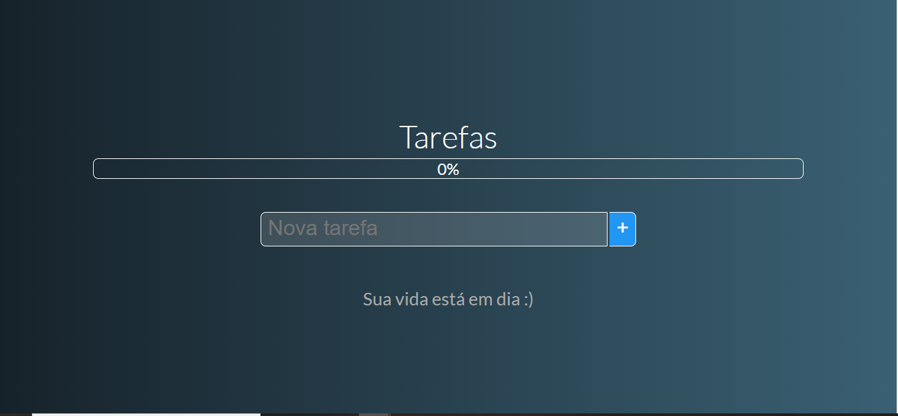
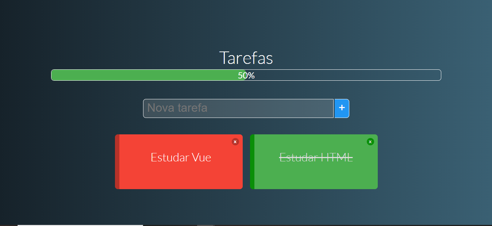
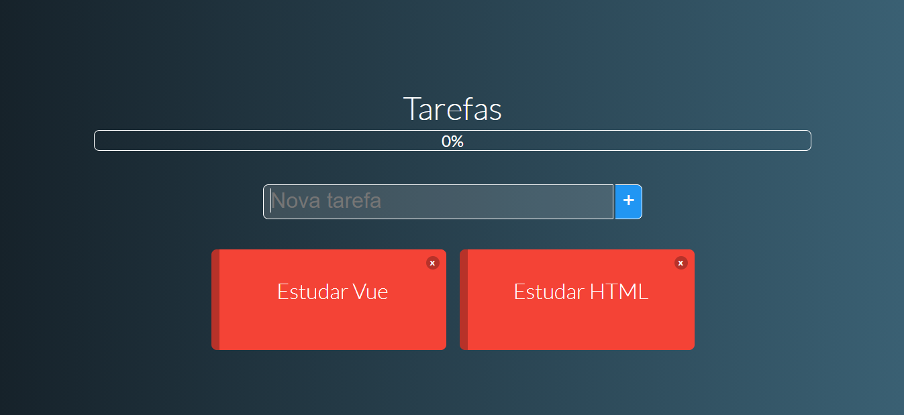
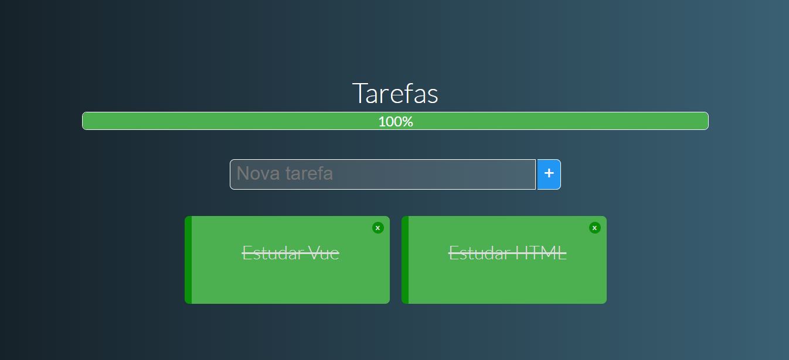

<h1 align="center">
   
</h1>

<h4 align="center"> 
	🚧 Tarefas (TODO) VUEJS 🚀 Concluido...  🚧
</h4>


## 📚 Descrição
  - Esse projeto serve para salvar(LocalStorage) tarefas, marca-las como concluídas, removelas e desmarca-las.

## 🛠 Tecnologias

As seguintes ferramentas foram usadas na construção do projeto:

-  [Vuejs](https://vuejs.org/)
-  [JavaScript](https://developer.mozilla.org/pt-BR/docs/Web/JavaScript)
-  [HTML5](https://developer.mozilla.org/pt-BR/docs/Web/HTML)

## 🖥️ Plataforma adotada

  - WEB
  
## 📸 Screenshot
  
  <p float="left">
	  
	  
  </p>
  
  <p float="left">
	  
	  
  </p>

## Project setup
```
npm install
```

### Compiles and hot-reloads for development
```
npm run serve
```

### Compiles and minifies for production
```
npm run build
```

### Run your tests
```
npm run test
```

### Lints and fixes files
```
npm run lint
```

### Customize configuration
See [Configuration Reference](https://cli.vuejs.org/config/).
